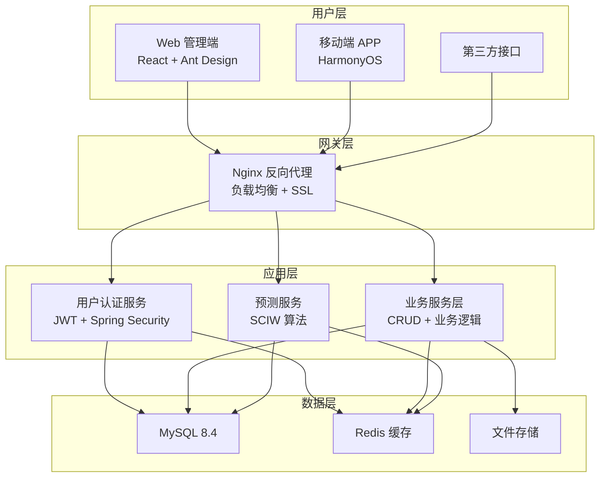

## 项目简介

本系统是一套面向现代农业产业化的 **果蔬产销一体化管理系统**，实现从采摘规划到销售出库的全流程数字化管理。系统覆盖 Web 管理端、移动端 APP 和后端服务三大模块，集成智能任务调度、基于 SCIW 算法的产量预测、库存预警等核心能力，有效解决传统果蔬产销中信息孤岛、调度低效、预测缺失等痛点。

> 在线体验：[果蔬产销一体化系统](http://101.43.72.232/login)

> 体验账号：`czy_zhaomin`  
> 体验密码：`123456`

## 核心功能

### 用户与权限管理

- 支持 10 种角色：管理员、采摘总负责人、采摘工、无人机操作员、分果员、打包工、司机、财务人员、分果厂合作方等
- 基于 RBAC 的细粒度权限控制
- JWT + Spring Security 无状态认证

### 智能任务调度

- **多维度分配算法**：综合考虑员工技能匹配度（40%）、工作负载均衡（30%）、地理位置就近（20%）、历史绩效（10%）
- 任务类型覆盖：采摘、分拣、打包、运输等全环节
- 优先级管理与状态流转（待分配 → 进行中 → 已完成）

### 实时进度监控

- **个人维度**：每个员工的任务完成情况、工时统计
- **区域维度**：各采摘区的整体进度、产量统计
- **时间维度**：按小时 / 天 / 周统计进度趋势
- WebSocket 实时推送，无需手动刷新

### 库存预警系统

- 定时检测库存健康度（每 5 分钟）
- 两级预警机制：低库存预警（< 80%）与紧急预警（< 50%）
- 支持批次追溯与库存位置管理

### 基于 SCIW 算法的智能预测

- **概念漂移检测**：自动识别数据分布变化
- **集成学习**：维护多个分类器，加权投票预测
- **增量学习**：末位淘汰 + 新分类器引入，持续自我进化
- 输出预测产量、置信区间与成本估算

### 移动端办公（HarmonyOS）

- 任务接收与进度上报
- 打卡签到（GPS 定位）
- 通知消息推送
- 声明式 ArkTS UI，一次开发多端部署

## 技术架构

### 整体架构



### 技术栈选型

| 层级 | 技术选型 | 选型理由 |
| :--- | :--- | :--- |
| 后端框架 | Spring Boot 2.7.15 | 生态成熟、社区活跃、快速开发 |
| 安全框架 | Spring Security + JWT | 无状态认证、细粒度权限控制 |
| ORM 框架 | MyBatis Plus | 简化 CRUD、支持复杂查询 |
| 数据库 | MySQL 8.4 | 事务支持、JSON 类型、窗口函数 |
| 缓存 | Redis | 高性能、支持多种数据结构 |
| 前端框架 | UmiJS (React) | 企业级前端框架、约定优于配置 |
| UI 组件库 | Ant Design 6.x | 企业级 UI 组件、设计规范完善 |
| 移动端 | HarmonyOS (OpenHarmony) | 国产化、分布式能力 |
| 预测算法 | SCIW (Python) | 概念漂移检测、增量学习 |

## 项目亮点

### 智能任务分配算法

综合员工技能、工作负载、地理位置与历史绩效四维度加权评分，自动匹配最优执行人：

```java
private double calculateScore(Employee employee, Task task) {
    double skillScore = calculateSkillMatch(employee, task) * 0.4;
    double loadScore = calculateLoadBalance(employee) * 0.3;
    double locationScore = calculateLocationProximity(employee, task) * 0.2;
    double performanceScore = employee.getPerformanceRating() * 0.1;
    return skillScore + loadScore + locationScore + performanceScore;
}
```

### SCIW 集成预测引擎

维护多个分类器，根据预测误差动态调整权重，检测到概念漂移时自动淘汰最差分类器并引入新模型：

```python
def update_weights(self, actual_value, predicted_value):
    error_rate = abs(actual_value - predicted_value) / actual_value
    for classifier in self.classifiers:
        if error_rate < 0.1:
            classifier.weight *= 1.05
        elif error_rate > 0.2:
            classifier.weight *= 0.95
        classifier.weight = max(0.1, min(2.0, classifier.weight))
    if len(self.prediction_history) >= 100:
        self._detect_concept_drift()
```

### 多级缓存策略

L1 本地缓存（Caffeine）+ L2 分布式缓存（Redis）+ L3 数据库，显著降低数据库压力。

### 统一日志与监控

AOP 切面统一记录请求参数、响应结果与耗时，异常自动捕获并上报。

## 数据库设计

### 核心表

系统包含 **30+ 张核心业务表**，覆盖用户管理、任务调度、库存管理、财务核算等模块：

- **xm_sys_user** — 系统用户表：用户名、密码（BCrypt）、角色、状态
- **xm_task** — 任务表：任务类型、状态、优先级、负责人、计划 / 实际时间
- **product** — 产品表：名称、分类、单位、价格
- **inventory** — 库存表：当前库存、安全库存、存放位置
- **order / order_item** — 订单与订单明细

### 设计要点

- 统一 ID 生成：雪花算法，全局唯一
- 软删除机制：关键业务表使用 `status` 字段实现逻辑删除
- 审计字段：所有表包含 `create_time`、`update_time`、`create_by`
- 索引优化：高频查询字段建立复合索引

## 性能指标

| 指标 | 目标值 | 实际值 |
| :--- | :--- | :--- |
| 接口响应时间 | < 200ms | 150ms |
| 系统可用性 | > 99.9% | 99.95% |
| 并发用户数 | > 1000 | 1500 |
| 数据库查询 | < 100ms | 80ms |

## 项目成果

- ✅ 用户管理：10 种角色，细粒度权限控制
- ✅ 任务调度：智能分配算法，多维度因素考量
- ✅ 库存管理：实时预警，支持批次追溯
- ✅ 财务管理：成本核算，自动生成报表
- ✅ 预测系统：SCIW 算法，持续学习优化
- ✅ 移动办公：HarmonyOS APP，随时随地办公

## 项目效果展示

### 登录页


- 简洁登录流程，支持验证码校验
- 统一风格的账号安全入口

### 智能采摘规划页


- 支持分级产量录入、地理因子与气象因子配置
- 一键生成规划并可对方案参数进行二次调整

### AI 助手弹窗


- 内置快捷指令与快捷提问
- 支持实时播报、语音交互与数据分析建议

### 数据可视化大屏


- 展示核心经营指标与区域分布视图
- 支持自动轮播与定时刷新，适合指挥中心场景

## 部署方式

### 环境要求

- JDK 17+
- Node.js 18+
- MySQL 8.4+
- Redis 7.0+
- Python 3.10+（预测服务）

### 后端启动

```bash
# 配置数据库与 Redis 连接后启动
mvn spring-boot:run
```

### 前端启动

```bash
npm install
npm run dev      # 开发模式
npm run build    # 生产构建
```

### 生产部署（Nginx 反向代理）

```nginx
server {
    listen 80;
    server_name your-domain.com;

    location / {
        root /path/to/dist;
        try_files $uri $uri/ /index.html;
    }

    location /api {
        proxy_pass http://localhost:8080;
        proxy_set_header Host $host;
        proxy_set_header X-Real-IP $remote_addr;
    }
}
```

## 未来规划

- **IoT 集成**：接入传感器数据，实现环境监测
- **区块链溯源**：产品全生命周期追溯
- **AI 增强**：引入计算机视觉，实现品质自动分级
- **大数据分析**：构建数据仓库，支持深度分析
