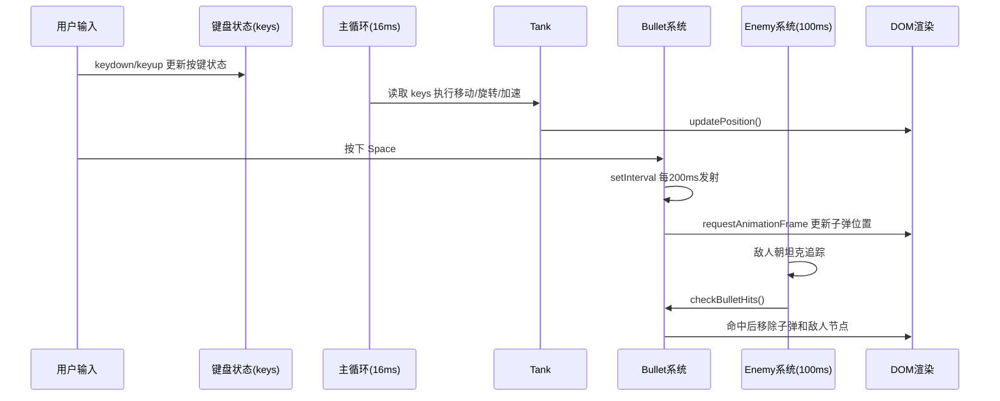

## 项目简介

这是一个基于原生 JavaScript + DOM 的 2D 坦克射击小游戏。项目重点不在大型引擎能力，而是通过最小技术栈完整实现“输入控制 -> 运动计算 -> 渲染更新 -> 碰撞判定 -> 对象销毁”的游戏主流程。

从源码看，项目已经具备一个小型动作游戏的核心闭环：

- 玩家坦克支持方向旋转、前进后退与 Shift 加速
- 空格键支持连发子弹（按下持续发射，松开停止）
- 敌人会持续朝坦克位置追踪
- 子弹命中敌人后即时移除对象与 DOM 节点

## 操作方式

- 方向键：控制前进 / 后退 / 转向
- Shift：加速移动
- 空格：连续发射子弹

## 项目结构

```text
public/坦克移动/
├─ html/task3.html      # 页面入口
├─ css/tanke.css        # 场景与角色样式
├─ js/tanke.js          # 游戏核心逻辑
└─ img/                 # 坦克、子弹、敌人与地形素材
```

页面入口非常轻量：`task3.html` 只负责挂载 `#game-container` 和 `#tank`，真正的状态与行为都在 `tanke.js`。

## 核心实现拆解

### 1. Tank 类：玩家状态与运动模型

`Tank` 类维护了玩家的关键状态：

- 位置：`x`, `y`
- 方向：`rotation`
- 速度：`baseSpeed=2`、`boostSpeed=4`
- 子弹池：`bullets[]`
- 连发控制：`isSpacePressed`、`bulletInterval`

移动是基于朝向角度计算的：将角度转为弧度后，通过三角函数更新坐标。

```js
const rad = this.rotation * Math.PI / 180;
const newX = this.x + Math.sin(rad) * this.speed;
const newY = this.y - Math.cos(rad) * this.speed;
```

这种写法的优点是：不管坦克朝向哪个角度，前进方向都与炮口方向一致，手感更自然。

### 2. 边界约束：防止角色移出可视区

`checkBoundaries(newX, newY)` 采用“先计算，再裁剪”的方式，按照坦克尺寸（60x60）限制活动范围：

- `x` 约束在 `[0, window.innerWidth - tankWidth]`
- `y` 约束在 `[0, window.innerHeight - tankHeight]`

这保证了角色始终留在场景内，不会出现半截出屏的问题。

### 3. 子弹系统：定时连发 + 帧动画

子弹发射分为两部分：

- 发射节奏：`setInterval(..., 200)` 控制每 200ms 发射一颗
- 运动渲染：`requestAnimationFrame` 每帧更新子弹位置

按住空格时：

1. 立即发射一颗
2. 启动连发定时器

松开空格时：

1. 清理连发定时器
2. 结束持续发射状态

子弹离开屏幕会被自动回收（移除 DOM + 从数组过滤），避免无效对象长期堆积。

### 4. 输入系统：按键状态表驱动主循环

项目没有直接在 `keydown` 里移动角色，而是维护了 `keys` 状态表，在 16ms 的主循环中统一读取：

- `ArrowUp/Down` -> 前进/后退
- `ArrowLeft/Right` -> 左右旋转
- `ShiftLeft/ShiftRight` -> 加速

这种“输入采集”和“逻辑更新”分离的写法更接近游戏开发范式，也便于后续扩展组合按键与手柄输入。

### 5. Enemy 类：归一化向量追踪

敌人通过 `moveToward(tankX, tankY)` 追踪玩家，核心是计算目标方向单位向量：

```js
const dx = tankX - this.x;
const dy = tankY - this.y;
const distance = Math.sqrt(dx * dx + dy * dy);
this.x += (dx / distance) * this.speed;
this.y += (dy / distance) * this.speed;
```

这样不论敌人距离远近，都能保持稳定追击速度，不会出现“近距离瞬移”现象。

### 6. 碰撞检测：距离阈值判定

`checkBulletHits()` 通过子弹与敌人中心点距离判定命中：

- 距离 `< 20` 视为碰撞
- 命中后执行：敌人销毁、子弹销毁、数组同步删除

该方案实现简单、性能成本低，非常适合该体量的小游戏。

## 主循环时序图

下面这张图对应当前项目的真实运行节奏，面试讲解时可以按这条链路展开：



## 关键代码精简版

下面是把项目代码抽象后的最小核心片段，适合放在分享里帮助读者快速抓住实现思路。

### 1) 输入与主循环

```js
const keys = {};

window.addEventListener('keydown', (e) => {
	keys[e.code] = true;
});

window.addEventListener('keyup', (e) => {
	keys[e.code] = false;
});

setInterval(() => {
	if (keys['ArrowUp']) tank.moveForward();
	if (keys['ArrowDown']) tank.moveBackward();
	if (keys['ArrowLeft']) tank.rotateLeft();
	if (keys['ArrowRight']) tank.rotateRight();
	tank.speed = (keys['ShiftLeft'] || keys['ShiftRight']) ? tank.boostSpeed : tank.baseSpeed;
}, 16);
```

### 2) 子弹运动

```js
function animateBullet(bullet) {
	const rad = bullet.direction * Math.PI / 180;
	bullet.x += Math.sin(rad) * bullet.speed;
	bullet.y -= Math.cos(rad) * bullet.speed;

	bullet.element.style.left = `${bullet.x}px`;
	bullet.element.style.top = `${bullet.y}px`;

	if (bullet.x < -20 || bullet.x > innerWidth || bullet.y < -20 || bullet.y > innerHeight) {
		bullet.element.remove();
		return;
	}

	requestAnimationFrame(() => animateBullet(bullet));
}
```

### 3) 敌人追踪与碰撞

```js
function moveToward(enemy, targetX, targetY) {
	const dx = targetX - enemy.x;
	const dy = targetY - enemy.y;
	const d = Math.hypot(dx, dy);
	if (!d) return;
	enemy.x += (dx / d) * enemy.speed;
	enemy.y += (dy / d) * enemy.speed;
}

function isHit(bullet, enemy) {
	return Math.hypot(bullet.x - enemy.x, bullet.y - enemy.y) < 20;
}
```

这三段基本对应了游戏的“输入、运动、判定”三条主线。

## 渲染与视觉设计

`tanke.css` 中的设计比较务实：

- 场景：草地图平铺（`grassland.png`）
- 坦克：60x60，围绕中心旋转
- 子弹：20x10，使用贴图素材
- 敌人：40x40 僵尸贴图
- 新手提示：10 秒后淡出，减少界面干扰

这套资源搭配让项目在“代码量小”的前提下，仍然有比较直观的玩法反馈。

## 技术点

- 键盘事件监听
- 角色位移与朝向三角函数计算
- `setInterval` 与 `requestAnimationFrame` 结合的动画更新
- 子弹运动、敌人追踪与对象回收
- 碰撞检测与对象销毁

## 可以继续优化的方向

1. 增加生命值、得分和游戏结束状态
2. 使用 `deltaTime` 统一帧率差异下的运动速度
3. 引入四叉树或网格分区优化大量敌人时的碰撞检测
4. 敌人生成改为波次机制（节奏递进）
5. 把图片朝向和炮口朝向进一步对齐，提升视觉一致性

## 展示价值

这个项目非常适合放在作品集中体现以下能力：

- 原生 JavaScript 面向对象建模（`Tank` / `Enemy`）
- 游戏循环与输入系统设计思路
- 几何计算在交互场景中的实际应用
- 对象生命周期管理（创建、更新、销毁）

对于前端初中级阶段，它是一个“代码不长但逻辑完整”的代表型项目。